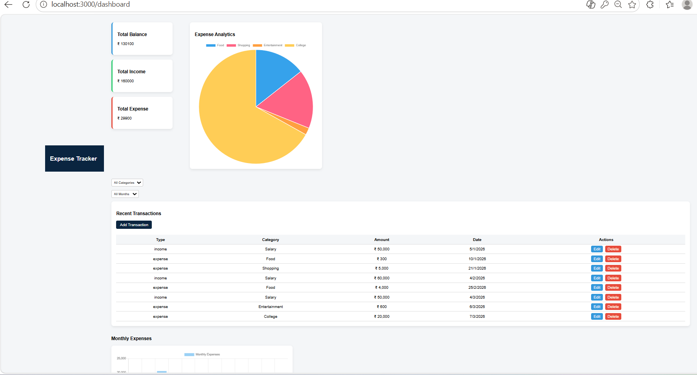

# Expense Tracker Dashboard

A full-stack expense management web application built using Node.js, Express, MySQL, and EJS.

## Features

- Add income and expense transactions
- Edit and delete transactions
- Monthly expense analytics
- Category-wise expense pie chart
- Responsive dashboard UI

## Tech Stack

Frontend:
- HTML
- CSS
- JavaScript
- EJS

Backend:
- Node.js
- Express.js

Database:
- MySQL

Charts:
- Chart.js

## Dashboard Preview

## How to Run

Clone the repository

git clone https://github.com/anjalisingh2179/expense-tracker-dashboard.git

Go to project folder

cd expense-tracker-dashboard

Install dependencies

npm install

Run server

node server.js

Open browser

http://localhost:3000
